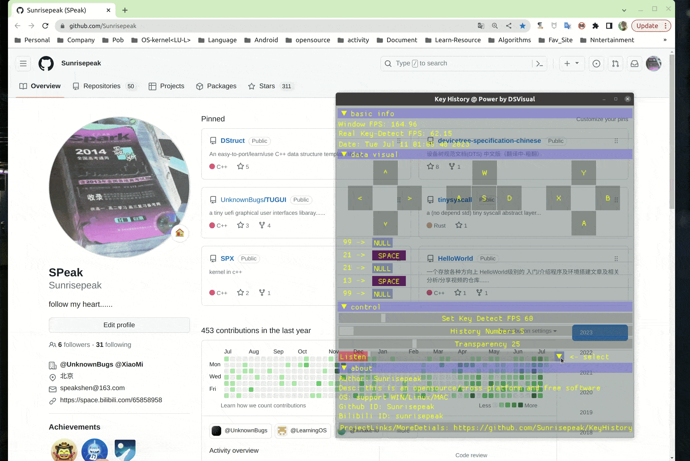
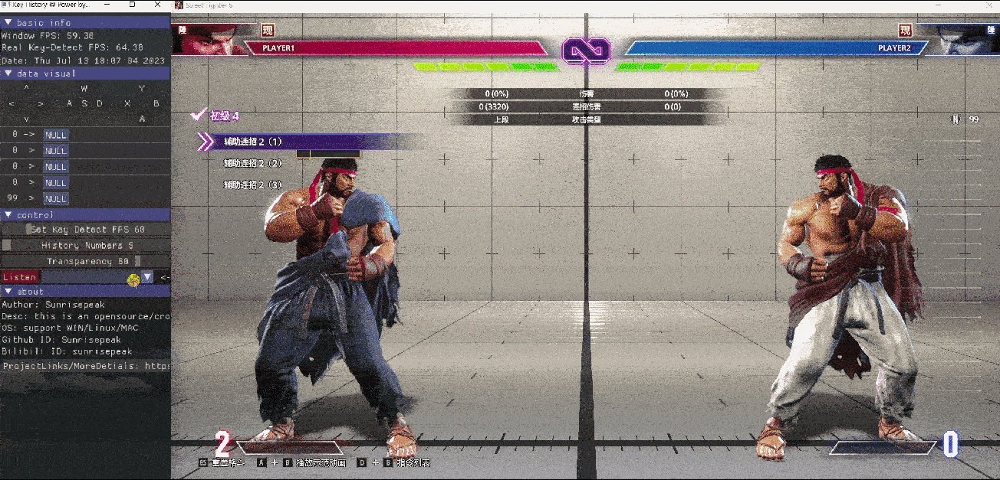

# KHistory
🔥KHistory 是一个优雅&跨平台的 键盘/🎮手柄按键 检测及历史记录显示工具, 无需安装单可执行文件(约900kb大小)即点即用

[**English**](README.en.md)

### 无需安装单文件下载即用

> **点击[Release](https://github.com/Sunrisepeak/KHistory/releases)获取对应平台最新版本**

## 一、功能特性

- 键盘按键检测
- 游戏手柄按键检测
- 控制
  - 按键历史记录数
  - 透明度
  - 检测帧率
  - 可视化插件选择
- 按键可视化及扩展(自定义按键布局/重映射按键名/按键高亮颜色自定义/其他)

## 二、平台支持情况

|      功能\平台      |  Linux   | Windows  | MacOS |  备注  |
| :-----------------: | :------: | :------: | :---: | :----: |
|    键盘按键检测     | &#x2705; | &#x2705; |       |        |
|    游戏手柄检测     |          | &#x2705; |       |        |
| 控制-按键历史记录数 | &#x2705; | &#x2705; |       |        |
|     控制-透明度     | &#x2705; | &#x2705; |       |        |
|    控制-检测帧率    | &#x2705; | &#x2705; |       |        |
|     按键可视化      | &#x2705; | &#x2705; |       | 已支持插件扩展/自定义  |
|     插件扩展        | &#x2705; | &#x2705; | &#x2705; |        |

**注: MacOS 后续支持**

## 三、可能的使用场景

- 教学教程类
- 直播
- 视频制作
- 个人操作分析
- 其他需要显示按键输入记录的场景

## 四、演示

### 键盘按键检测

### 游戏手柄按键检测

## 五、插件模块 / 自定义插件
> **开发者:** 可根据自己需求开发或扩展插件, 实现自定义的按键可视化面板
>
> **用户:** 可以根据使用场景选择对应/合适的插件进行按键的可视化(如键盘、游戏手柄), 如下图:
>

### 插件模块功能
- 插件基本功能 - 用户可根据场景自由切换插件进行按键可视化(如: 按键/游戏手柄...)
- Mini插件框架PluginBase -  提供标准接口和后台自动完成按键事件处理和布局(按键状态)更新功能
- 插件自动注册功能 - 把插件放置`kplugin/auto-register`目录即可在编译期自动注册
- 基础插件及插件扩展 - 已提供键盘和手柄基础插件及格斗游戏扩展插件, **用户无需了解C++/Imgui也可自己开发插件**
  - 自定义按键布局
  - 重映射按键名
  - 按键高亮颜色自定义
  - 其他

### 插件示例/基础插件

#### [Plugin Base - Keyboard](Keyboard.kplugin.hpp) - 基础键盘插件

#### [Plugin Base - Gamepad](kplugin/Gamepad.kplugin.hpp) - 基础手柄插件

### 插件 开发/自定义 流程 - 无需了解C++/Imgui

**Note: 插件及开发细节请参考 [插件说明文档](kplugin)**

## 六、贡献与更多有意思的插件

> 欢迎大家把有意思的插件晒到这个讨论中 - [KPlugin - 有意思的插件讨论](https://github.com/Sunrisepeak/KHistory/discussions/9)

## 七、相关视频

> **更多介绍/开发动向 视频分享 -〉[地址](https://space.bilibili.com/65858958/channel/seriesdetail?sid=3473247)**

- [开源软件: KHistory 按键检测及历史记录显示工具介绍](https://www.bilibili.com/video/BV1Xx4y1o7cp)
- [KHistory: 街霸6 让一追二 使用C语言打出”高光”操作](https://www.bilibili.com/video/BV1W14y1X7vD)
- [开源软件: KHistory 按键检测工具插件模块基础功能及扩展介绍](https://www.bilibili.com/video/BV1Uk4y1g7aU)

## 八、相关链接

- [**KHistory**](https://github.com/Sunrisepeak/KHistory)
- [**DSVisual**](https://github.com/Sunrisepeak/DSVisual)
- [**DStruct**](https://github.com/Sunrisepeak/DStruct)
- [**imgui**](https://github.com/ocornut/imgui)
- [**xmake**](https://github.com/xmake-io/xmake)
