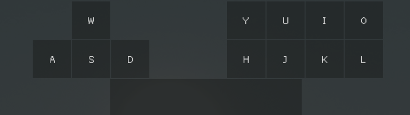
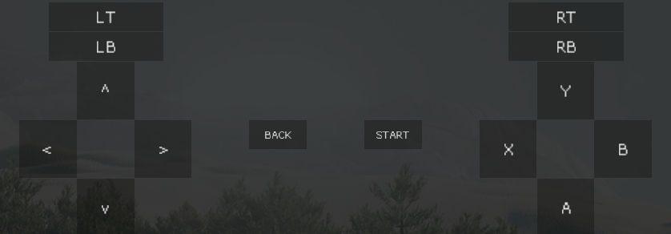
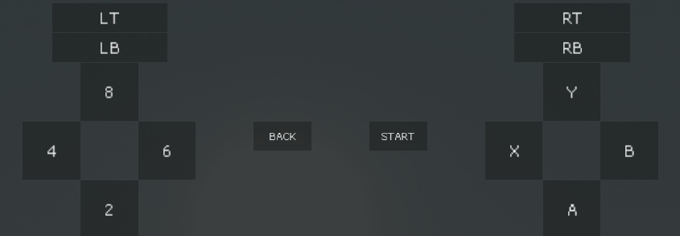

# KHistory
🔥KHistory 是一个优雅&跨平台的 键盘/🎮手柄按键 检测及历史记录显示工具, 无需安装单可执行文件(约900kb大小)即点即用

[**English**](README.en.md)

### 无需安装单文件下载即用

> **点击[Release](https://github.com/Sunrisepeak/KHistory/releases)获取对应平台最新版本**

## 一、功能特性

- 键盘按键检测
- 游戏手柄按键检测
- 控制
  - 按键历史记录数
  - 透明度
  - 检测帧率
- 游戏按键可视化(待优化)

## 二、平台支持情况

|      功能\平台      |  Linux   | Windows  | MacOS |  备注  |
| :-----------------: | :------: | :------: | :---: | :----: |
|    键盘按键检测     | &#x2705; | &#x2705; |       |        |
|    游戏手柄检测     |          | &#x2705; |       |        |
| 控制-按键历史记录数 | &#x2705; | &#x2705; |       |        |
|     控制-透明度     | &#x2705; | &#x2705; |       |        |
|    控制-检测帧率    | &#x2705; | &#x2705; |       |        |
|   游戏按键可视化    | &#x2705; | &#x2705; |       | 待优化 |
|                     |          |          |       |        |

**注: MacOS 后续支持**

## 三、可能的使用场景

- 教学教程类
- 直播
- 视频制作
- 个人操作分析
- 其他需要显示按键输入记录的场景

## 四、演示

### 键盘按键检测

### 游戏手柄按键检测

## 五、插件模块 / 自定义插件
> 开发者可以根据自己需求开发或扩展插件, 实现自定义的按键可视化面板

### 插件示例/基础插件

#### [KeyboardBasePlugin.kplugin](kplugin/KeyboardBasePlugin.kplugin.hpp) - 基础键盘插件

#### [GamepadBasePlugin.kplugin](kplugin/GamepadBasePlugin.kplugin.hpp) - 基础手柄插件

#### [GamepadBasePlugin-Fighting.kplugin](kplugin/GamepadBasePlugin-Fighting.kplugin.hpp) - 基于 基础手柄插件 的扩展插件

## 五、相关视频

> **更多介绍/开发动向 视频分享 -〉[地址](https://space.bilibili.com/65858958/channel/seriesdetail?sid=3473247)**

- [开源软件: KHistory 按键检测及历史记录显示工具介绍](https://www.bilibili.com/video/BV1Xx4y1o7cp)
- [KHistory: 街霸6 让一追二 使用C语言打出”高光”操作](https://www.bilibili.com/video/BV1W14y1X7vD)

## 六、相关链接

- [**KHistory**](https://github.com/Sunrisepeak/KHistory)
- [**DSVisual**](https://github.com/Sunrisepeak/DSVisual)
- [**DStruct**](https://github.com/Sunrisepeak/DStruct)
- [**imgui**](https://github.com/ocornut/imgui)
- [**xmake**](https://github.com/xmake-io/xmake)
