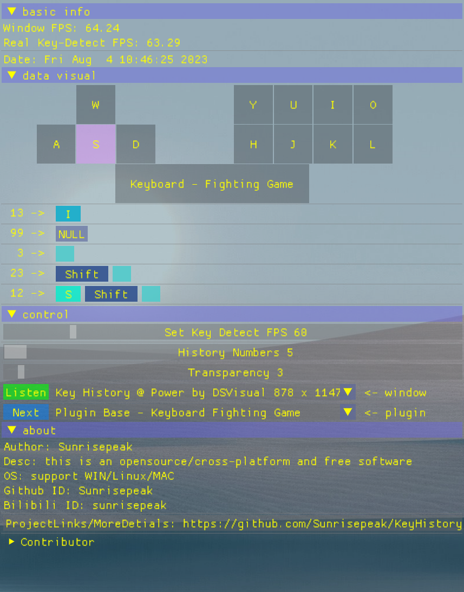
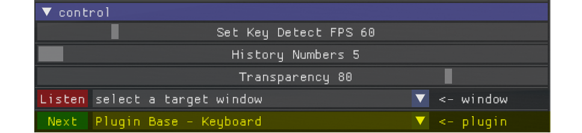
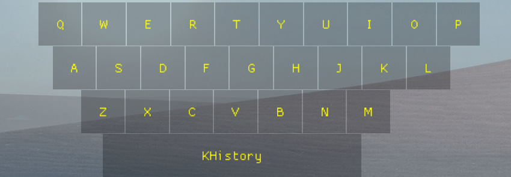
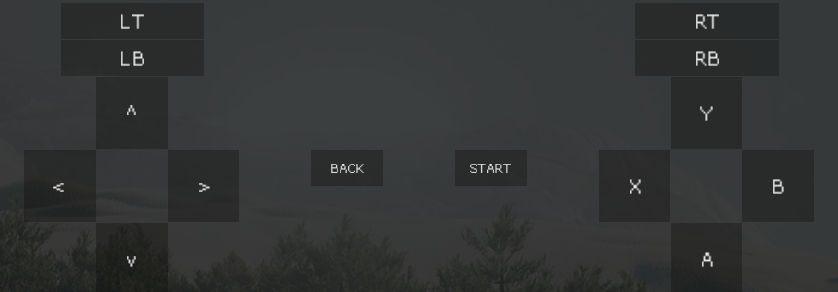
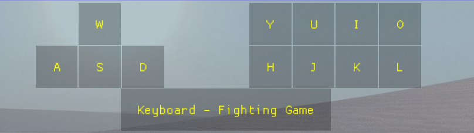
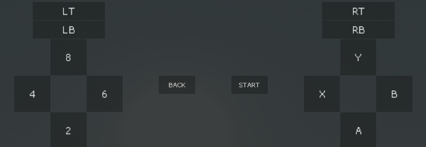
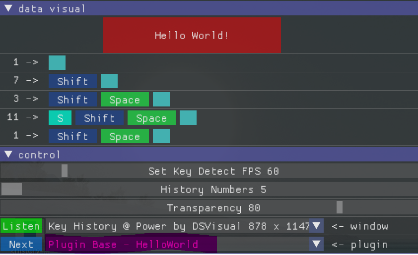
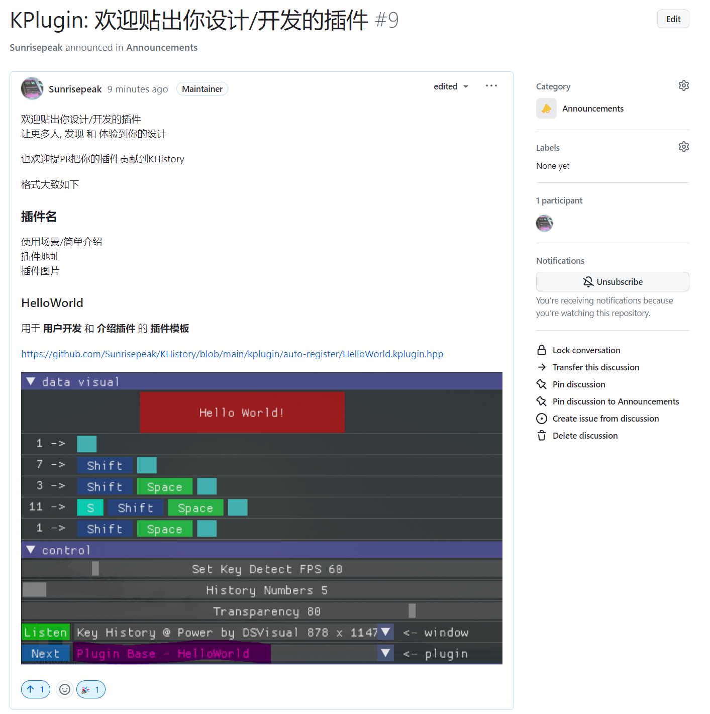

## KPlugin Module - 插件模块 / 自定义插件

> 背景: 为了增加可玩性 给KHistory开发一个插件模快KPlugin, 让更多的人能根据自己的使用环境和需求定制/开发按键可视化插件

KPlugin 是KHistory的插件模块, 为其提供基础的插件功能和插件的扩展能力



### 一、功能特性
- 插件基本功能 - 用户可根据场景自由切换插件进行按键可视化(如: 按键/游戏手柄...)
- Mini插件框架PluginBase -  提供标准接口和后台自动完成按键事件处理和布局(按键状态)更新功能
- 插件自动注册功能 - 把插件放置`kplugin/auto-register`目录即可在编译期自动注册
- 基础插件及插件扩展 - 已提供键盘和手柄基础插件及格斗游戏扩展插件, **用户无需了解C++/Imgui也可自己开发插件**
  - 自定义按键布局
  - 重映射按键名
  - 按键高亮颜色自定义
  - 其他


### 二、使用说明

> 在KHistory的控制模块, 用户可以通过`Next`按钮或插件的下拉菜单中选择合适的插件, 如下图



### 三、插件示例

#### 基础插件

##### [Plugin Base - Keyboard](Keyboard.kplugin.hpp) - 基础键盘插件


##### [Plugin Base - Gamepad](Gamepad.kplugin.hpp) - 基础手柄插件


#### 扩展插件

##### [Plugin Base - Keyboard Fighting Game](auto-register/KeyboardFightingGame.kplugin.hpp) - 键盘格斗游戏插件


##### [Plugin Base - Gamepad - Fighting Game - 2468](auto-register/GamepadFightingGame2468.kplugin.hpp) - 手柄格斗游戏2468插件



### 四、插件开发/扩展

> KPlugin的扩展和开发是极其容易的
>
> 通过PluginBase提供的标准&统一的接口和自动注册机制, 极大的简化了插件的开发
>
> **不需要 插件开发者 了解C++/imgui等知识, 只需具备程序的编译能力即可轻松开发一个自己的 按键可视化插件**


#### 基本流程
- 1.在`kplugin/auto-register`目录创建`YourPluginName.kplugin.hpp`插件文件(或者直接复制`HelloWorld.kplugin.hpp`并重命名)

- 2.继承插件基础接口 - `PluginBase`

- 3.实现按键布局 - `keyLayoutImpl`

- 4.自定义按键颜色(可选) - `keyColorTableRemap`

- 5.自定义按键名(可选) - `keyNameTableRemap`

- 6.xmake重新构建项目, 自动完成插件注册

#### 流程/开发过程说明 - 基于插件模板 [HelloWorld](auto-register/HelloWorld.kplugin.hpp)



**1.创建插件文件**

在`kplugin/auto-register`目录创建以`.kplugin.hpp`后缀的插件文件(或者直接复制`HelloWorld.kplugin.hpp`并重命名). 文件名的格式如下:

```
YourPluginName.kplugin.hpp
    |            |
 插件的名字    插件标识
```
所以HelloWorld插件对应的文件名就是 `HelloWorld.kplugin.hpp`

> 注意: 这个插件名, 也是后面插件的class名, 他们需要保持一致

**2.继承插件基础接口**

继承PluginBase并通过_mPluginName对插件进行命名

实现keyLayoutImpl布局接口，这样就完成了一个最小插件的开发, 但它的布局里并不显示任何东西

```cpp

#include "PluginBase.hpp"

namespace khistory {

class HelloWorld : public PluginBase {
public:
    HelloWorld() {
        // 通过_mPluginName对插件进行命名
        _mPluginName += " - HelloWorld";
    }
public: // 接口实现
    virtual void keyLayoutImpl(float layoutWidth, float layoutHeight) {

    }
};

} // namespace khistory end

```

**3.实现按键布局**

keyLayoutImpl 的layoutWidth, layoutHeight 参数表示可布局区域布局/画布的 宽和高, 示意图如下:

```
            +---------------> layoutWidth / X
            |
            |  Hello World!
            |
            V
    layoutHeight / Y

```

我们可以根据这个信息, 去设计按键在可布局区域的位置
如下将显示一个空格键:
- 宽为layoutWidth的一半
- 高为 按键宽的 1/6
- 绘制起始坐标为 (startPosX, startPosY) 即 (layoutWidth / 4, 0)
- 按键中字体大小为系统字体的0.8倍

```cpp

virtual void keyLayoutImpl(float layoutWidth, float layoutHeight) override {
    float buttonWidth = layoutWidth / 2;
    float buttonHeight = buttonWidth / 6;
    float startPosX = layoutWidth / 4;
    float startPosY = 0;

    _drawKey(
        KeyCode::KEYBOARD_SPACE,    // keycode
        startPosX, startPosY,       // cursorPosX, cursorPosY
        buttonWidth, buttonHeight,  // key/button width, height
        0.8                         // font scale
    );
}

```

`_drawKey`绘制按键 - 参数说明

- keycode: 统一的按键码 参考 `PluginBase::KeyCode`
- cursorPosX: 绘制的X坐标, -1表示使用默认值
- cursorPosY: 绘制的Y坐标, -1表示使用默认值
- width: 按键的宽, 0表示使用默认值
- height: 按键的宽, 0表示使用默认值
- fontScale: 字体的缩放倍数, 0表示使用默认值

```cpp
void _drawKey(int keycode, float cursorPosX = -1, float cursorPosY = -1, float width = 0, float height = 0, float fontScale = 0)
```

**4.自定义按键颜色(可选)** - 实现`keyColorTableRemap`

这是个可选的功能, 如下就是就是给按键颜色表中空格键配置为红色

根据需求可在这个函数中对多个按键的颜色进行 配置/自定义

格式:`_mkeyColorTable[KeyCode] = { R, G, B, T };` 其中 0.0f <= R/G/B/T <= 1.0f

```cpp
virtual void keyColorTableRemap() override {
    // reset keyboard space highlight color      R/红   G/绿  B/蓝  T/透明度
    _mkeyColorTable[KeyCode::KEYBOARD_SPACE] = { 1.0f, 0.0f, 0.0f, 0.5f };
}
```

**5.自定义按键名(可选)** - 实现`keyNameTableRemap`

同上这也是个可选的功能, 如下是给空格键重新命名为`Hello World!`

格式:`_mkeyNameTable[KeyCode] = "KeyCode::Key's KeyName";` 其中 0.0f << R/G/B/T << 1.0f

```cpp
virtual void keyNameTableRemap() override {
    _mkeyNameTable[KeyCode::KEYBOARD_SPACE] = "Hello World!";
}
```

**6.xmake重新构建项目, 自动完成插件注册**
> 需要有xmake环境

```bash
xmake
xmake r
```

## 五、贡献与更多有意思的插件

> 欢迎大家把有意思的插件晒到这个讨论中 - [KPlugin - 有意思的插件讨论](https://github.com/Sunrisepeak/KHistory/discussions/9)




### 六、相关链接

- [**KHistory 项目主页**](https://github.com/Sunrisepeak/KHistory)
- [**Github**](https://github.com/Sunrisepeak)
- [**DSVisual**](https://github.com/Sunrisepeak/DSVisual)
- [**DStruct**](https://github.com/Sunrisepeak/DStruct)